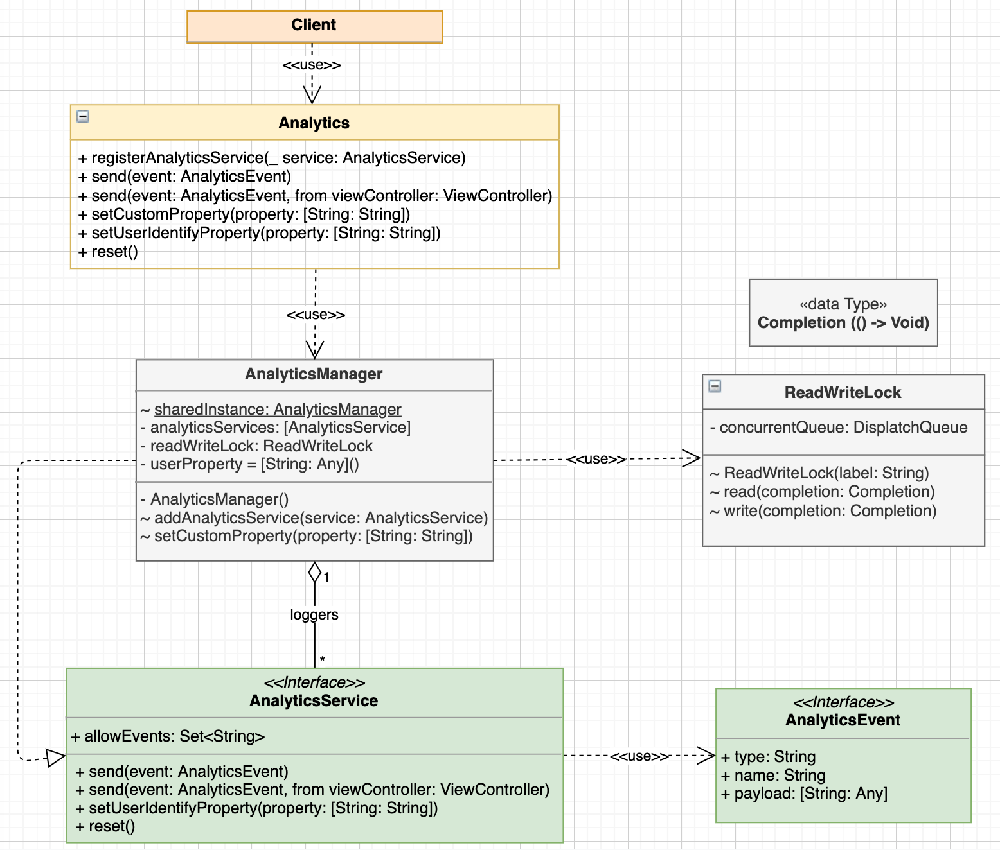
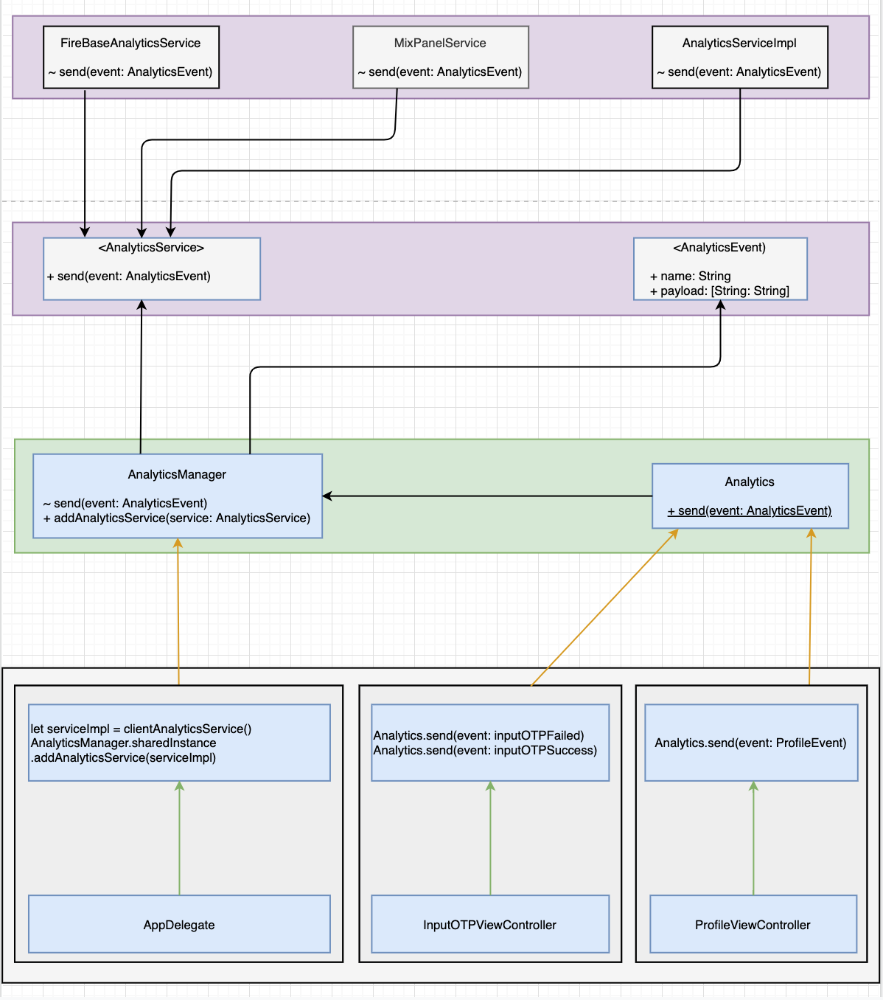

# DLAnalytics

An abstract Analytics Framework supports:

- Unify Analytics.
- Modularize, Centralize Analytics.
- Plugin the new Analytics easier.
- Standadize tracking method and event.

## Requirements

- Xcode 11+
- Swift 5.0+

## Architecture

## Interaction Flow

## License

DLAnalytics is available under the MIT license. See the [LICENSE](LICENSE) file for more info.
